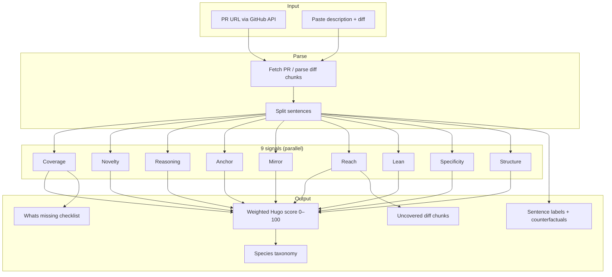
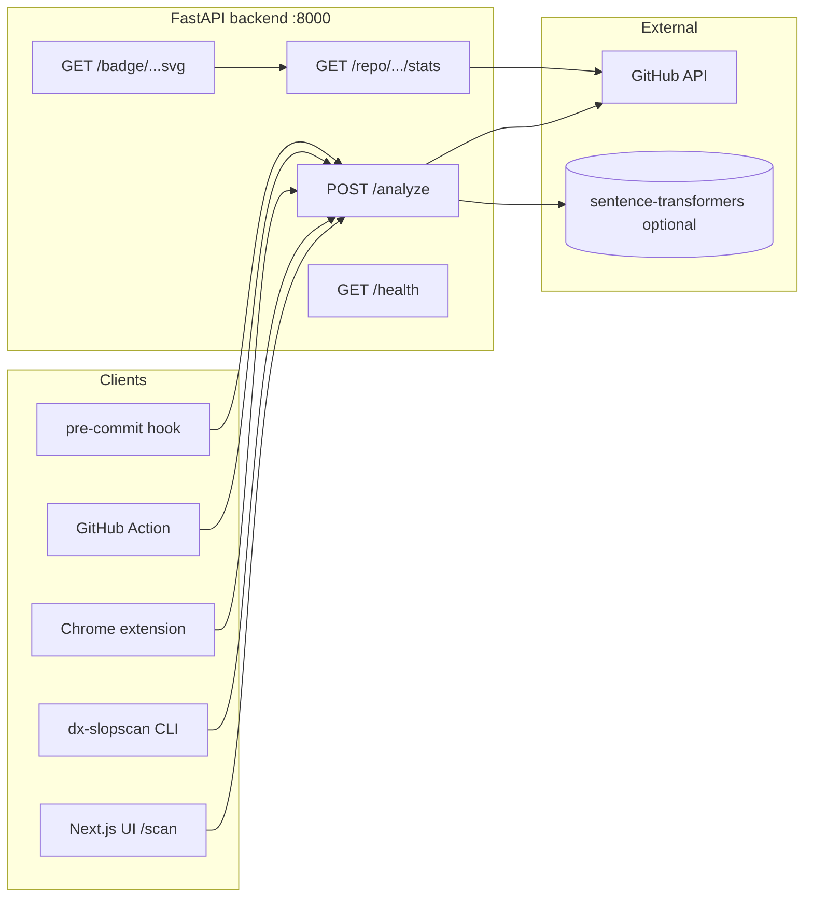
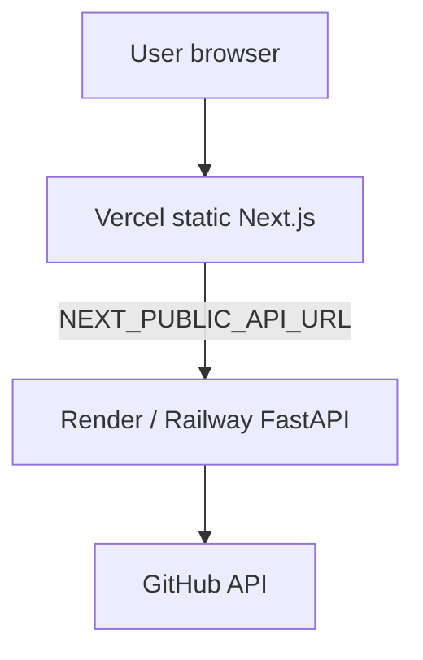
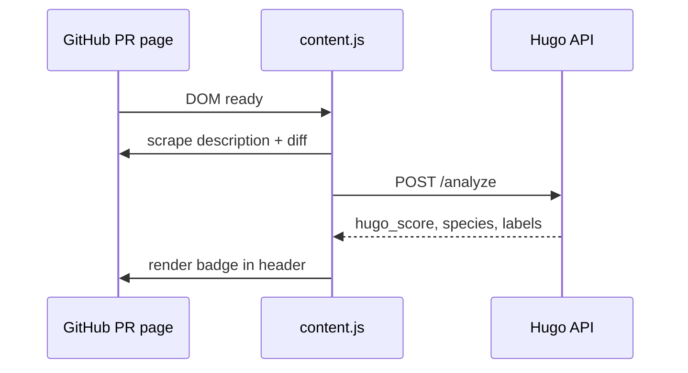

<div align="center">


<br /><br />

### Not *"is this AI?"* — **did a human think?**

[](https://github.com/brainRottedCoder/dx-slopscan/actions)
[](LICENSE)
[](https://github.com/brainRottedCoder/dx-slopscan)
[](SUBMISSION.md)

**Epistemic contribution scoring for pull request descriptions and documentation** — nine signals, eleven slop species, zero LLM calls in the detection path.

> **Slop Scan Hackathon 2026** — Track A (Code Review) + Track B (Docs & KBs).  
> Submission: [SUBMISSION.md](SUBMISSION.md) · Live app: [dx-slopscan.vercel.app/scan](https://dx-slopscan.vercel.app/scan)

[Quick start](#quick-start) · [Architecture](#architecture) · [Detection engine](#detection-engine) · [Web app](#web-application) · [Benchmark](#benchmark-corpus--evaluation) · [Deploy](DEPLOYMENT.md) · [Contributing](CONTRIBUTING.md)

</div>

---

## Table of contents

1. [Overview](#overview)
2. [Problem & philosophy](#problem--philosophy)
3. [How Hugo scores a PR](#how-hugo-scores-a-pr)
4. [Architecture](#architecture)
5. [Detection engine](#detection-engine)
6. [Eleven slop species](#eleven-slop-species)
7. [Sentence labels](#sentence-labels)
8. [Web application](#web-application)
9. [API reference](#api-reference)
10. [CLI](#cli-dx-slopscan)
11. [Chrome extension](#chrome-extension)
12. [GitHub Action & pre-commit hook](#github-action--pre-commit-hook)
13. [Benchmark corpus & evaluation](#benchmark-corpus--evaluation)
14. [Project structure](#project-structure)
15. [Quick start](#quick-start)
16. [Configuration](#configuration)
17. [Makefile commands](#makefile-commands)
18. [CI/CD](#cicd)
19. [Deployment](#deployment)
20. [Limitations & known failure modes](#limitations--known-failure-modes)
21. [Hackathon bonus point claims](#hackathon-bonus-point-claims)
22. [Contributing & license](#contributing--license)

---

## Overview

**Hugo** (DX SlopScan) is an open-source system that scores pull request descriptions on a **0–100** scale by measuring **epistemic contribution**: how much of the text could *not* be inferred from the diff alone.

| What Hugo measures | What Hugo does *not* measure |
|--------------------|------------------------------|
| Rationale, tradeoffs, risks, specificity | Whether text was written by an LLM |
| Diff-relative novelty and reach | Code correctness or test pass rate |
| Reviewer-oriented structure | Team culture or author intent |

Slop that only restates the diff scores low. Descriptions with genuine reviewer value score high. Classification uses **rule-based signals and embeddings** — **no LLM calls** on the detection path.

| Score | Label | Meaning |
|:-----:|-------|---------|
| 76–100 | **Quality** | Strong epistemic contribution |
| 51–75 | **Low Slop** | Mostly useful; some gaps |
| 26–50 | **Medium Slop** | Significant restatement or missing context |
| 0–25 | **High Slop** | Largely derivable from the diff |

**Repository:** [github.com/brainRottedCoder/dx-slopscan](https://github.com/brainRottedCoder/dx-slopscan)  
**Stack:** FastAPI (Python) · Next.js 14 (static export) · Node CLI · Chrome MV3 extension

---

## Problem & philosophy

Modern PR descriptions often **mirror the diff**: file names, verbs like “updated” and “fixed,” and generic openers (“This PR improves…”). Reviewers still have to reverse-engineer **why** a change exists, what was rejected, and what to scrutinize.

Hugo reframes quality as **epistemic work**:

- **Slop reports** — it describes *what* changed.
- **Humans think** — they explain *why*, *what else was considered*, and *what could go wrong*.

The product is deliberately **auditable**: every signal has inspectable inputs; species classifications cite evidence substrings and counterfactual fixes. Optional UI features (Rewrite Coach, LLM Predict) call **Groq from the browser only** and never affect the core score.

---

## How Hugo scores a PR

### Ensemble formula

```
Hugo = Coverage×0.18 + Novelty×0.20 + Reasoning×0.18 + Anchor×0.10
     + (1−Mirror)×0.10 + Reach×0.08 + Lean×0.03
     + Specificity×0.06 + Structure×0.07
```

Weights are configurable in [`backend/core/config.py`](backend/core/config.py). The engine lives in [`backend/detection/engine.py`](backend/detection/engine.py).

### End-to-end analysis flow



### Short descriptions

If the description has **fewer than three sentences**, the raw ensemble is multiplied by **0.85** to reduce false positives on terse but valid kernel-style PRs. A `false_positive_warning` is returned when score &lt; 30 and word count &lt; 40.

---

## Architecture

### System context



### Component responsibilities

| Component | Role | LLM in path? |
|-----------|------|----------------|
| **Backend** | Signal computation, species, API | **No** |
| **Frontend** | Scan UI, rankings, taxonomy, simulator | **No** (optional Groq tabs only) |
| **CLI** | Terminal scoring, hook installer | **No** |
| **hugo-extension** | Inline badge on GitHub PR pages | **No** |
| **benchmark-corpus** | Offline labeled evaluation | **No** |
| **`.github/workflows`** | CI tests + PR comment bot | **No** |

### Deployment topology (production)



See **[DEPLOYMENT.md](DEPLOYMENT.md)** for environment variables, CORS, and verification steps.

---

## Detection engine

All detection code lives under [`backend/detection/`](backend/detection/). Entry point: `analyze()` in [`engine.py`](backend/detection/engine.py).

### Nine signals

| Signal | Weight | Module | What it measures |
|--------|:------:|--------|------------------|
| **Coverage** | 18% | [`signals/coverage.py`](backend/detection/signals/coverage.py) | Epistemic checklist: WHY, tradeoffs, alternatives, risks, evidence, scope, rollback, migration (PR mode); docs mode adds example, prerequisite, steps |
| **Novelty** | 20% | [`signals/novelty.py`](backend/detection/signals/novelty.py) | Per-sentence similarity to diff chunks (embedding or TF-IDF fallback) |
| **Reasoning** | 18% | [`signals/reasoning.py`](backend/detection/signals/reasoning.py) | Epistemic acts: causal, contrastive, alternative, tradeoff, hypothesis, constraint, uncertainty |
| **Anchor** | 10% | [`signals/mirror.py`](backend/detection/signals/mirror.py) | Causal connectors tied to named diff entities |
| **Mirror** | 10% (inverted) | [`signals/mirror.py`](backend/detection/signals/mirror.py) | Vocabulary overlap with diff (high = bad) |
| **Reach** | 8% | [`signals/reach.py`](backend/detection/signals/reach.py) | How well description sentences cover each diff chunk |
| **Lean** | 3% | [`signals/lean.py`](backend/detection/signals/lean.py) | Unique content words vs filler (anti-padding) |
| **Specificity** | 6% | [`signals/specificity.py`](backend/detection/signals/specificity.py) | Numbers, identifiers, technical depth |
| **Structure** | 7% | [`signals/structure.py`](backend/detection/signals/structure.py) | Sections, bullets, reviewer-oriented layout |

**Confidence** (reported, not in ensemble): derived from novelty signal stability.

Canonical IDs: [`backend/detection/signal_registry.py`](backend/detection/signal_registry.py) · Frontend mirror: [`frontend/lib/signals.ts`](frontend/lib/signals.ts)

### Novelty & reach: full vs fast mode

| Mode | When | Novelty / Reach |
|------|------|-----------------|
| **Full** | `sentence-transformers` installed | `paraphrase-MiniLM-L3-v2` cosine similarity |
| **Fast** | Default Docker / minimal install | TF-IDF cosine similarity (no ~90MB model) |

`GET /health` reports the configured `st_model`. Run `make benchmark-full` for evaluation with the embedding model.

### Coverage anti-gaming

Coverage triggers must appear in **substantive** sentences (minimum content words near the pattern). Stub lines like `Root cause:` or `because.` do not count. This blocks template attacks that list checklist headers without real prose.

### Reasoning (ECS v3)

Three layers in [`reasoning.py`](backend/detection/signals/reasoning.py):

1. **Act detection** — regex triggers for epistemic act types.
2. **Clause specificity** — score the *reason clause*, not the trigger word.
3. **Anti-gaming** — dampen entity stuffing, act monoculture, verbosity bombs, known templates.

### Species classifier

After signals are computed, [`signals/species.py`](backend/detection/signals/species.py) assigns zero or more of **11 species** using auditable rules (e.g. `Novelty < 0.35 AND Mirror > 0.60` → **ECHO**).

### GitHub PR ingestion

When `pr_url` is provided, [`github_parser.py`](backend/detection/github_parser.py) fetches title, body, and diff via the GitHub API. Set `GITHUB_TOKEN` for 5000 req/hr vs 60 unauthenticated.

### Request / response models

Defined in [`backend/core/models.py`](backend/core/models.py):

- **Input:** `pr_url` *or* (`description` + optional `diff`), `mode`: `"pr"` | `"docs"`
- **Output:** `hugo_score`, `slop_label`, `sentences[]`, `signals`, `whats_missing`, `species[]`, `uncovered_chunks[]`, `processing_ms`, optional warnings

---

## Eleven slop species

Each species includes a glyph, confidence, **evidence** (verbatim substring), **counterfactual**, and **fix**. Full UX copy: [`frontend/lib/species.ts`](frontend/lib/species.ts).

| Glyph | Type | Name | Typical signal pattern |
|:-----:|------|------|------------------------|
| ◈ | ECHO | The Echo | High mirror, low novelty — restates the diff |
| ◎ | HOLLOW | The Hollow | No WHY, no risk, no reasoning |
| ◇ | HAZE | The Haze | Jargon without causality |
| ⊙ | SPIRAL | The Spiral | Circular, repetitive sentences |
| ◐ | SURFACE | The Surface | What without why |
| ◉ | STENCIL | The Stencil | Generic openers, interchangeable text |
| ◫ | FUSE | The Fuse | No evidence, risks, or lasting decision context |
| ◌ | GHOST | The Ghost | Too short to review |
| ▣ | BULLET | The Bullet | List dump without narrative |
| ◬ | VAULT | The Vault | Security-sensitive diff, no security discussion |
| ▤ | PADDING | The Padding | Low lean, high word count |

Browse interactively at **`/taxonomy`** in the web app.

---

## Sentence labels

Every sentence in the description receives a label used in the Scan UI heatmap:

| Label | Color | Meaning |
|-------|-------|---------|
| **red** | Derivability high | Restates the diff |
| **orange** | Partial overlap | Some diff overlap |
| **green** | Novel | Adds information not in the diff |
| **purple** | Epistemic | Contains a detected reasoning act |

Labels drive per-sentence **counterfactual** hints (e.g. “Explain WHY this change was necessary”).

---

## Web application

Next.js 14 app under [`frontend/`](frontend/). Production build is a **static export** deployed to Vercel. Routes are centralized in [`frontend/lib/routes.ts`](frontend/lib/routes.ts).

### Canonical routes

| Route | Purpose |
|-------|---------|
| `/` | Landing: product story, signal overview, links |
| `/scan` | **Main analyzer** — PR URL, paste description+diff, full breakdown |
| `/signals` | Interactive **score simulator** — tweak signal sliders, see predicted Hugo |
| `/taxonomy` | **11 species** reference with examples and fixes |
| `/rankings` | Repo-level **leaderboard** via `GET /repo/{owner}/{repo}/stats` |
| `/evaluation` | Benchmark methodology and corpus stats |
| `/setup` | CLI, GitHub Action, extension, badge embed instructions |
| `/doc-quality` | Documentation-mode scoring guidance (`mode: docs`) |

### Legacy redirects

Bookmarks and old links redirect via [`frontend/vercel.json`](frontend/vercel.json):

| Old path | New path |
|----------|----------|
| `/analyze` | `/scan` |
| `/simulator` | `/signals` |
| `/species` | `/taxonomy` |
| `/leaderboard` | `/rankings` |
| `/benchmark` | `/evaluation` |
| `/integrations` | `/setup` |
| `/docs` | `/doc-quality` |

### Scan page features (`/scan`)

| Feature | File | Notes |
|---------|------|-------|
| PR URL / paste analysis | [`app/scan/page.tsx`](frontend/app/scan/page.tsx) | Calls `POST /analyze` |
| Signal breakdown bars | [`components/SignalBreakdown.tsx`](frontend/components/SignalBreakdown.tsx) | Nine signals + coverage checks |
| Diff heatmap | [`app/scan/DiffHeatmap.tsx`](frontend/app/scan/DiffHeatmap.tsx) | Uncovered chunks visualization |
| Score simulator (inline) | [`app/scan/ScoreSimulator.tsx`](frontend/app/scan/ScoreSimulator.tsx) | What-if on current result |
| Template generator | [`app/scan/TemplateGenerator.tsx`](frontend/app/scan/TemplateGenerator.tsx) | PR body scaffold from gaps |
| Rewrite Coach | [`app/scan/RewriteCoach.tsx`](frontend/app/scan/RewriteCoach.tsx) | **Optional** — requires `NEXT_PUBLIC_GROQ_KEY` |
| LLM Predict tab | `page.tsx` | **Optional** — Groq only; not used in score |

Deep link: `/scan?pr=https://github.com/owner/repo/pull/123`

### Frontend ↔ API

[`frontend/lib/api.ts`](frontend/lib/api.ts) resolves `NEXT_PUBLIC_API_URL` (falls back to localhost in dev, default Render URL on production hosts).

---

## API reference

Base URL: `http://localhost:8000` (local) or your deployed API.

### `POST /analyze`

Score a PR description.

**Body (JSON):**

```json
{
  "pr_url": "https://github.com/owner/repo/pull/42",
  "description": "optional if pr_url set",
  "diff": "optional unified diff text",
  "mode": "pr"
}
```

Provide either `pr_url` or non-empty `description`. `diff` improves novelty, mirror, reach, and anchor when not using `pr_url`.

**Example:**

```bash
curl -s -X POST http://localhost:8000/analyze \
  -H "Content-Type: application/json" \
  -d '{
    "description": "Root cause: token refresh fired after expiry on drifted clocks. We refresh at 80% TTL; load tests show 40% fewer 401s. Risk: extra refresh traffic on small nodes.",
    "diff": "File: auth.ts\n+ refresh at 0.8 * ttl"
  }'
```

### `GET /health`

Liveness, model name, signal list, `llm_calls_in_detection: 0`.

### `GET /repo/{owner}/{repo}/stats`

Analyzes recent merged PRs (fast mode, no full embedding required). Returns median score, distribution, best/worst PRs, author trends.

### `GET /badge/{owner}/{repo}.svg`

Shields.io-style SVG badge from repo median Hugo score (cached ~1 hour).

---

## CLI (`dx-slopscan`)

Package: [`cli/`](cli/) · Published name: **`dx-slopscan`**

```bash
# Check a GitHub PR
npx dx-slopscan check https://github.com/owner/repo/pull/123

# Paste mode (interactive)
npx dx-slopscan check --paste [--mode pr|docs]

# JSON output
npx dx-slopscan check <url> --json

# API health
npx dx-slopscan health

# Install git pre-commit hook
npx dx-slopscan install-hook
```

Environment:

| Variable | Default | Purpose |
|----------|---------|---------|
| `HUGO_API_URL` | `https://dx-slopscan.onrender.com` | Backend base URL |

---

## Chrome extension

Folder: [`hugo-extension/`](hugo-extension/) · Docs: **[hugo-extension/README.md](hugo-extension/README.md)**

Injects a live Hugo badge on `github.com/*/pull/*` pages. Scrapes visible description + diff hunks, calls `POST /analyze`, shows score, slop tier, and species glyphs. Click opens full breakdown at `{APP_URL}/scan?pr=...`.



**Install:** Chrome → Extensions → Developer mode → Load unpacked → select `hugo-extension/`.

---

## GitHub Action & pre-commit hook

### PR comment workflow

[`.github/workflows/hugo-check.yml`](.github/workflows/hugo-check.yml) runs on PR `opened`, `edited`, `synchronize`. Uses [`.github/actions/hugo`](.github/actions/hugo) to call your API and upsert a comment with score, signals, species, and coverage checklist.

**Required secrets:**

| Secret | Purpose |
|--------|---------|
| `HUGO_API_URL` | Backend base URL |

### Pre-commit hook

[`hooks/pre-commit`](hooks/pre-commit) analyzes `COMMIT_EDITMSG` via the API. Install with `make install-hook` or `npx dx-slopscan install-hook`.

| Variable | Default |
|----------|---------|
| `HUGO_API_URL` | `https://dx-slopscan.onrender.com` |
| `HUGO_THRESHOLD` | `20` (block commit if below) |

---

## Benchmark corpus & evaluation

Folder: [`benchmark-corpus/`](benchmark-corpus/) — **not shipped** to production; used for research and regression.

| Artifact | Description |
|----------|-------------|
| `quality_prs.jsonl` / `slop_prs.jsonl` | **193** labeled PRs (106 quality, 87 slop) |
| `generate_corpus.py` | Regenerate JSONL (`make corpus`) |
| `synthetic_expansion.py` | Synthetic templates for corpus growth |
| `_benchmark_runner.py` | Fast benchmark (`make benchmark`) |
| `evaluate.py` | Full benchmark with embeddings (`make benchmark-full`) |
| `adversarial_test.py` | 50 anti-gaming scenarios (`make adversarial`) |
| `cross_validate.py` | Ablation / cross-validation (`make cross-validate`) |

Labeling rubric: [`benchmark-corpus/labeling_methodology.md`](benchmark-corpus/labeling_methodology.md)  
Error analysis: [`benchmark-corpus/error_analysis.md`](benchmark-corpus/error_analysis.md)  
Limitations: [`benchmark-corpus/limitations.md`](benchmark-corpus/limitations.md)

### Latest fast-benchmark metrics (threshold 25)

| Metric | Value |
|--------|------:|
| Precision (slop detection) | 0.957 |
| Recall (slop detection) | 0.840 |
| F1 | 0.894 |
| Accuracy | 0.891 |

Quality vs slop mean scores: **38.3** vs **23.4** (fast mode). Re-run `make benchmark` after signal changes.

### Confusion matrix (193 PRs, threshold = 25)

```
                   Predicted
                  Quality   Slop
Actual  Quality |   103  |   3  |   (106)
        Slop    |    14  |  73  |   (87)
                   (117)   (76)
```

- **True positive rate** (slop caught): 73 / 87 = **83.9%**
- **False positive rate** (quality flagged as slop): 3 / 106 = **2.8%**
- **True negative rate** (quality cleared): 103 / 106 = **97.2%**
- **False negative rate** (slop missed): 14 / 87 = **16.1%**

### Known failure modes (honest numbers)

| Failure mode | Impact | Rate |
|--------------|--------|------|
| Terse excellence (short high-quality PRs) | False positive | ~3–5% |
| Non-English descriptions | Reasoning accuracy drop | ~15% |
| Entity injection gaming | False negative | Partially mitigated |
| High-context internal PRs | False positive | Threshold-dependent |

These are documented in [`benchmark-corpus/limitations.md`](benchmark-corpus/limitations.md) and [`benchmark-corpus/error_analysis.md`](benchmark-corpus/error_analysis.md).

---

## Project structure

```
dx-slopscan/
├── backend/                    # FastAPI detection API
│   ├── core/                   # config.py, models.py
│   ├── detection/
│   │   ├── engine.py           # Orchestration
│   │   ├── github_parser.py    # PR fetch + diff parse
│   │   ├── repo_analytics.py   # Repo stats endpoint
│   │   ├── signal_registry.py
│   │   └── signals/            # coverage, novelty, reasoning, …
│   ├── tests/test_signals.py
│   ├── Dockerfile
│   └── requirements.txt
├── frontend/                   # Next.js static export
│   ├── app/
│   │   ├── scan/               # Analyzer + coach tools
│   │   ├── signals/            # Score simulator
│   │   ├── taxonomy/           # Species reference
│   │   ├── rankings/           # Repo leaderboard
│   │   ├── evaluation/         # Benchmark UI
│   │   ├── setup/              # Integrations
│   │   └── doc-quality/        # Docs mode guide
│   ├── components/             # Nav, SignalBreakdown, …
│   └── lib/                    # api.ts, routes.ts, signals.ts, species.ts
├── benchmark-corpus/           # Labeled evaluation (offline)
├── cli/                        # npx dx-slopscan
├── hugo-extension/             # Chrome MV3
├── hooks/pre-commit            # Optional git hook
├── .github/
│   ├── workflows/ci.yml
│   ├── workflows/hugo-check.yml
│   └── actions/hugo/
├── docker-compose.yml          # Dev stack (API :8000, UI :3000)
├── docker-compose.prod.yml     # Production-like stack
├── render.yaml                 # Render blueprint
├── Makefile                    # test, benchmark, demo, deploy-verify
├── DEPLOYMENT.md
└── CONTRIBUTING.md
```

---

## Quick start

### Prerequisites

- **Python 3.11+**
- **Node.js 18+**
- Optional: **Docker** for one-command demo
- Optional: **`GITHUB_TOKEN`** for PR URL analysis and repo stats

### Clone and configure

```bash
git clone https://github.com/brainRottedCoder/dx-slopscan
cd dx-slopscan

cp backend/.env.example backend/.env    # add GITHUB_TOKEN if needed
cp frontend/.env.local.example frontend/.env.local
cp .env.example .env                    # for docker-compose only
```

### Install everything

```bash
make install
make test
```

### Run with Docker (recommended demo)

```bash
make demo
```

- API: **http://localhost:8000**
- UI: **http://localhost:3000/scan**

### Run services separately

```bash
# Terminal 1 — API
cd backend
pip install -r requirements.txt
uvicorn main:app --reload --port 8000

# Terminal 2 — UI
cd frontend
npm install
npm run dev
```

Open **http://localhost:3000/scan** and paste a description + diff, or paste a public PR URL.

### Optional: full embedding mode

For production-grade novelty/reach (not in default `requirements.txt`):

```bash
pip install sentence-transformers
```

---

## Configuration

### Backend (`backend/.env`)

| Variable | Default | Description |
|----------|---------|-------------|
| `GITHUB_TOKEN` | *(empty)* | GitHub API auth |
| `ALLOWED_ORIGINS` | `*` | CORS origins (comma-separated) |
| `PORT` | `8000` | HTTP port |
| `weight_*` | see `config.py` | Signal ensemble weights (must sum to 1.0) |
| `novelty_red_threshold` | `0.72` | Sentence → “red” similarity |
| `novelty_green_threshold` | `0.42` | Sentence → “green” similarity |
| `reach_uncovered_threshold` | `0.42` | Chunk flagged as uncovered |
| `st_model` | `paraphrase-MiniLM-L3-v2` | Sentence transformer name |

### Frontend (`frontend/.env.local`)

| Variable | Required | Description |
|----------|----------|-------------|
| `NEXT_PUBLIC_API_URL` | Production | Backend URL (no trailing slash) |
| `NEXT_PUBLIC_GROQ_KEY` | Optional | Rewrite Coach / LLM Predict only |

---

## Makefile commands

| Command | Purpose |
|---------|---------|
| `make install` | Install backend, CLI, and frontend deps |
| `make test` | Run `backend/tests/test_signals.py` |
| `make benchmark` | Fast corpus evaluation → `benchmark_results.json` |
| `make benchmark-full` | Full evaluation with sentence-transformers |
| `make adversarial` | 50-scenario anti-gaming suite |
| `make corpus` | Regenerate benchmark JSONL |
| `make demo` | `docker-compose up` dev stack |
| `make deploy-local` | Production Docker compose |
| `make deploy-verify` | pytest + `npm run build` gate |
| `make install-hook` | Copy pre-commit hook into `.git/hooks/` |
| `make cross-validate` | Ablation / cross-validation study |
| `make clean` | Remove caches and build artifacts |

---

## CI/CD

[`.github/workflows/ci.yml`](.github/workflows/ci.yml) on push/PR to `main`:

1. **test** — Python 3.11, `pytest tests/test_signals.py`
2. **build-frontend** — Node 20, `npm run build` with `NEXT_PUBLIC_API_URL`

[`.github/workflows/hugo-check.yml`](.github/workflows/hugo-check.yml) — optional PR quality comments (requires `HUGO_API_URL` secret).

Local full gate:

```bash
make deploy-verify
```

---

## Deployment

Production checklist, Render/Vercel/Docker steps, and troubleshooting:

**→ [DEPLOYMENT.md](DEPLOYMENT.md)**

Quick verify after deploy:

```bash
curl https://YOUR-API/health
curl -X POST https://YOUR-API/analyze \
  -H "Content-Type: application/json" \
  -d '{"description":"We chose Redis because writes dominate; p99 dropped 40%. Risk: memory on small nodes.","diff":"+ redis client"}'
```

---

## Limitations & known failure modes

Hugo is a **heuristic ensemble**, not ground truth. Documented in [`benchmark-corpus/limitations.md`](benchmark-corpus/limitations.md) and benchmark `failure_modes`:

| Failure mode | What happens |
|--------------|--------------|
| **Terse excellence** | Short, high-quality kernel PRs may score &lt; 40 |
| **Entity injection** | Copying identifiers from diff can inflate reasoning |
| **Non-English** | Reasoning regexes are English-first (~15% accuracy drop) |
| **High-context teams** | Brief internal PRs over-flagged |
| **Template attacks** | Partially mitigated by per-sentence content checks |

Hugo does **not** detect: malicious code, test quality, AI authorship, or whether the change is correct.

Use scores as **review prompts**, not merge blockers, unless your team explicitly adopts thresholds.

---

## Hackathon bonus point claims

Built for the [Slop Scan Hackathon](https://slopscan.raptors.dev) (May 29 – Jun 1, 2026):

| Bonus | Claim |
|-------|-------|
| **Cross-Track Scanner (+3)** | Track A (`/scan`) + Track B (`/doc-quality`) from one unified 9-signal engine |
| **Open Source Ready (+3)** | `npx dx-slopscan`, MIT, CI, CONTRIBUTING.md |
| **The Bake-Off (+5)** | 193-PR labeled corpus, confusion matrix in [Benchmark](#benchmark-corpus--evaluation) |
| **Live Fire (+5)** | Any public `github.com/*/pull/*` URL analyzed live via GitHub API; Chrome extension fires on real PR pages |

Full submission: **[SUBMISSION.md](SUBMISSION.md)**

---

## Contributing & license

Contributions welcome — especially **taxonomy**, **benchmark labels**, and **anti-gaming**. See **[CONTRIBUTING.md](CONTRIBUTING.md)**.

| Area | Where to start |
|------|----------------|
| New species | `backend/detection/signals/species.py` + `frontend/lib/species.ts` |
| New signal logic | `backend/detection/signals/` + `backend/tests/test_signals.py` |
| Corpus labels | `benchmark-corpus/generate_corpus.py` |

**License:** [MIT](LICENSE)

---

<div align="center">

**Hugo** — measure whether a human thought, not whether a machine wrote.

[Scan a PR](https://dx-slopscan.vercel.app/scan) · [Report an issue](https://github.com/brainRottedCoder/dx-slopscan/issues)

</div>
