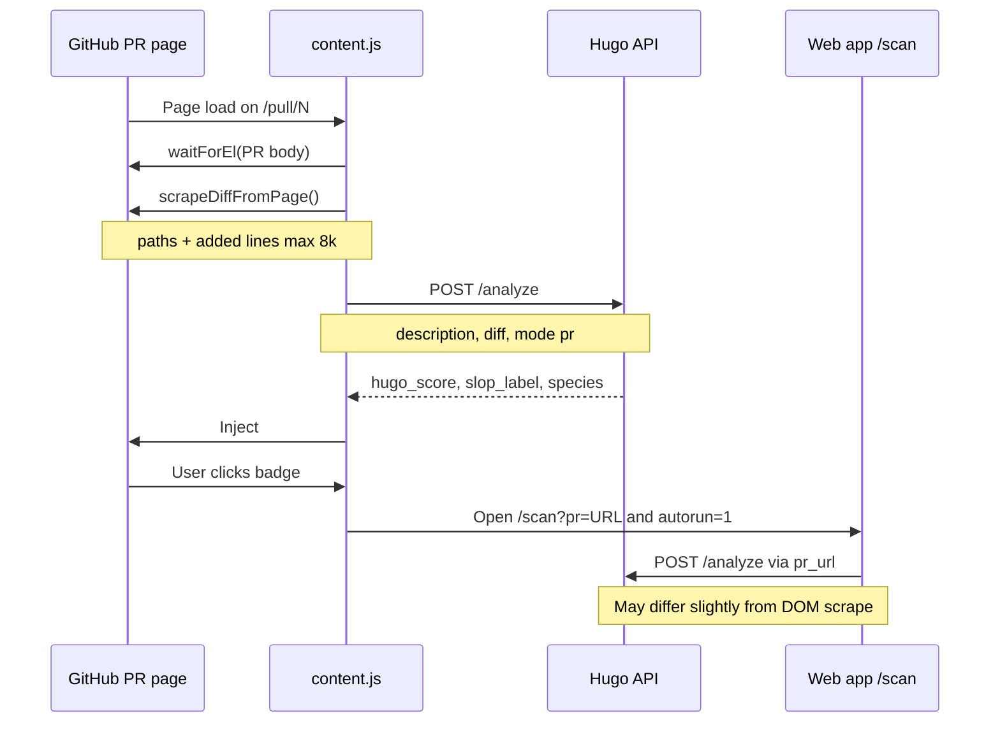

# Hugo Chrome Extension

Epistemic PR scores on GitHub pull request pages — same **9-signal** Hugo backend as the web app and CLI. **Zero LLM calls** in the detection path.

**Repository:** [brainRottedCoder/dx-slopscan](https://github.com/brainRottedCoder/dx-slopscan)

---

## Table of contents

1. [Overview](#overview)
2. [What you see](#what-you-see)
3. [Install](#install)
4. [How it works](#how-it-works)
5. [End-to-end workflow](#end-to-end-workflow)
6. [Configure](#configure)
7. [Signals](#signals-used-same-as-full-hugo)
8. [Troubleshooting](#troubleshooting)
9. [File map](#file-map)
10. [Privacy and security](#privacy-and-security)
11. [Related tools](#related-tools)

---

## Overview

The extension injects a live **Hugo score badge** on every `github.com/*/pull/*` page. It reads the PR description (and visible diff when the Files changed tab is open), calls `POST /analyze`, and shows score, slop label, and species glyphs inline.

| Component | Location | Role |
|-----------|----------|------|
| Manifest | [`manifest.json`](manifest.json) | Chrome MV3, matches `https://github.com/*/pull/*` |
| Content script | [`content.js`](content.js) | Scrape DOM, call API, inject badge |
| Styles | [`content.css`](content.css) | Badge hover and layout (aligned with web `globals.css`) |
| Icons | [`icons/`](icons/) | Toolbar PNGs (16 / 48 / 128) |
| API contract | `POST {API_URL}/analyze` | Body: `description`, optional `diff`, `mode: "pr"` |
| Response used | `hugo_score`, `slop_label`, `species[]`, `processing_ms` | Same field names as web [`lib/api.ts`](../frontend/lib/api.ts) |

**Viewing diagrams:** Mermaid blocks render on **GitHub.com** and in editors with a Mermaid plugin. Plain-text flowcharts below work everywhere (VS Code preview, npm, offline).

---

## What you see

On a pull request page, the badge is prepended to `.gh-header-actions` or `.js-sticky-offset-scroll`:

```text
+------------------------------------------+
| [H]  23/100   HIGH SLOP              [>] |
|      species chips   312ms · 0 LLM       |
+------------------------------------------+
```

| UI element | Meaning |
|------------|---------|
| Hugo mark | Teal lockup (matches `frontend/public/icon.svg`) |
| **23/100** | `hugo_score` (color tiers match `/scan`) |
| **HIGH SLOP** | `slop_label` from API |
| Species chips | `species[].glyph` with per-type colors |
| **↗** | Opens full analyzer on the web app |

### Score color tiers

| Score range | Color | CSS tier class |
|-------------|-------|----------------|
| 76–100 | `#7AE2CF` | `hugo-badge--tier-quality` |
| 51–75 | `#FDEB9E` | `hugo-badge--tier-low` |
| 26–50 | `#e07000` | `hugo-badge--tier-medium` |
| 0–25 | `#ff5c6a` | `hugo-badge--tier-high` |

### Click behavior

Opens:

```text
{APP_URL}/scan?pr={encodeURIComponent(github_pr_page_url)}&autorun=1
```

Default `APP_URL`: `https://dx-slopscan.vercel.app`. The scan page pre-fills the PR URL and runs analysis automatically (`autorun=1`).

Legacy bookmark `/analyze?pr=...` still works on the web app (redirects to `/scan`).

---

## Install

### Load unpacked (development)

| Step | Action |
|:----:|--------|
| 1 | Clone [dx-slopscan](https://github.com/brainRottedCoder/dx-slopscan) |
| 2 | Open Chrome → `chrome://extensions/` |
| 3 | Enable **Developer mode** (top right) |
| 4 | Click **Load unpacked** → select the `hugo-extension/` folder |
| 5 | Open any **public** GitHub pull request |

### Toolbar icons

If Chrome warns about missing icons, generate PNGs from the repo root:

```powershell
powershell -NoProfile -File scripts/generate-extension-icons.ps1
```

Then reload the extension on `chrome://extensions/`.

### Permissions

| Permission | Why it is needed |
|------------|------------------|
| `activeTab` | Inject on the current GitHub tab |
| `storage` | Optional overrides for `API_URL` and `APP_URL` via `chrome.storage.sync` |
| `https://github.com/*` | Content script runs only on GitHub PR URLs |

The extension does not exfiltrate GitHub credentials. It only reads DOM text you can already see and sends it to **your configured Hugo API**.

---

## How it works

### Pipeline (numbered)

1. **URL gate** — Run only when the path matches `/pull/{number}`.
2. **Wait for body** — Up to 5s for `.js-comment-body` or `[data-testid="pr-body"]`.
3. **Validate** — Skip if description is missing or shorter than 10 characters.
4. **Scrape diff** — `scrapeDiffFromPage()` collects file paths and added lines (see below).
5. **Analyze** — `POST /analyze` with `{ description, diff?, mode: "pr" }`.
6. **Render badge** — Inject `#hugo-badge` with score, label, species chips.
7. **Deep link** — Click opens `/scan?pr=...&autorun=1` on `APP_URL`.

### Diff scraping

Improves **Novelty**, **Reach**, and **Anchor** compared to description-only scoring.

| Source | DOM selectors | Limit |
|--------|---------------|-------|
| Changed file paths | `.file-info a.Link--primary`, `[data-path]`, `.file-header .file-info a` | All unique paths |
| Added lines | `.blob-code-addition .blob-code-inner` | First **100** lines |
| Combined payload | Concatenated text | **8000** characters max |

If the **Files changed** tab is not visible, the extension still scores using the description only (diff omitted from the request).

### API request example

```http
POST https://dx-slopscan.onrender.com/analyze
Content-Type: application/json

{
  "description": "<PR body plain text>",
  "diff": "<file paths and added lines, if any>",
  "mode": "pr"
}
```

### API response fields used

```json
{
  "hugo_score": 48.6,
  "slop_label": "Medium Slop",
  "species": [{ "type": "ECHO", "name": "The Echo", "glyph": "◈", "confidence": 0.82 }],
  "processing_ms": 312
}
```

Other fields (`signals`, `sentences`, `whats_missing`) are returned by the API but not shown on the badge; open the web `/scan` page for the full breakdown.

---

## End-to-end workflow

### Diagram (Mermaid — GitHub and compatible viewers)



### Diagram (ASCII — all viewers)

```text
  GitHub PR page
        |
        |  DOM: PR body + optional diff scrape
        v
   content.js
        |
        |  POST /analyze  { description, diff?, mode: "pr" }
        v
   Hugo API  ----------------->  hugo_score, slop_label, species[]
        |
        v
   #hugo-badge on PR header
        |
        |  user click
        v
   Web app /scan?pr=<github-url>&autorun=1
        |
        |  POST /analyze  { pr_url, mode: "pr" }  (GitHub API fetch)
        v
   Full 9-signal UI, sentences, coverage checklist
```

### Data flow comparison

| Path | Description source | Diff source | Best for |
|------|-------------------|-------------|----------|
| Extension badge | DOM (PR body) | DOM scrape (Files tab) | Instant inline score while reviewing |
| Web `/scan?pr=` | GitHub API | GitHub API | Canonical full report, shareable URL |
| CLI / GitHub Action | GitHub API | GitHub API | CI and terminal workflows |

Scores can differ slightly between extension and `/scan?pr=` when the visible DOM diff does not match what the GitHub API returns.

---

## Configure

### Default endpoints

Defined in [`content.js`](content.js) as `DEFAULT_CONFIG`:

| Key | Default | Purpose |
|-----|---------|---------|
| `API_URL` | `https://dx-slopscan.onrender.com` | Backend base URL (`POST /analyze`, `GET /health`) |
| `APP_URL` | `https://dx-slopscan.vercel.app` | Frontend base URL (deep link to `/scan`) |

### Override without editing code

1. Open `chrome://extensions/` → Hugo → **Details** → **Extension options** (or DevTools).
2. Or use DevTools → **Application** → **Extension storage** → **Sync**.
3. Set keys `API_URL` and/or `APP_URL` (no trailing slash).
4. Reload the extension.

Example local development:

| Key | Value |
|-----|-------|
| `API_URL` | `http://localhost:8000` |
| `APP_URL` | `http://localhost:3000` |

### CORS

The public Render API sets `ALLOWED_ORIGINS=*`. For a private backend, set `ALLOWED_ORIGINS` in `backend/.env` to include `https://github.com` (or `*` for testing).

Verify connectivity:

```bash
curl -s https://dx-slopscan.onrender.com/health
```

After deploying v2 backend, `signals` in the response should list nine names (`coverage`, `novelty`, `reasoning`, …) — not legacy `dris` / `ecs`.

---

## Signals used (same as full Hugo)

When `diff` is included, all **nine** scoring signals participate in `hugo_score`:

| Signal | Weight | Role on PR pages |
|--------|:------:|------------------|
| Coverage | 18% | WHY, tradeoffs, alternatives, risks, evidence |
| Novelty | 20% | Sentences not predictable from scraped diff |
| Reasoning | 18% | Causal, contrastive, tradeoff patterns |
| Anchor | 10% | Causal links to diff entities / paths |
| Mirror | 10% | Diff vocabulary overlap (inverted in score) |
| Reach | 8% | Diff changes not explained in prose |
| Lean | 3% | Anti-padding / filler |
| Specificity | 6% | Numbers, identifiers, concrete detail |
| Structure | 7% | Sections, bullets, reviewer layout |

Weights match [`frontend/lib/signals.ts`](../frontend/lib/signals.ts) and `backend/core/config.py`.

---

## Troubleshooting

| Symptom | Likely cause | What to do |
|---------|--------------|------------|
| No badge | Body too short or not rendered yet | Refresh; wait for PR description |
| Badge shows **Unavailable** | API down, CORS, or network | Check `API_URL`; open `{API_URL}/health` |
| Stuck on **Scanning PR…** | Slow API or cold start (Render free tier) | Wait; check Network tab for `POST /analyze` |
| Score differs from CI comment | Extension uses DOM diff; Action uses GitHub API | Expected; prefer Action for CI canonical score |
| Click opens wrong host | `APP_URL` override or old build | Set `APP_URL` in extension storage |
| Console: `[Hugo] Could not score PR` | 4xx/5xx, private repo without token on API | Use public PR or self-host API with `GITHUB_TOKEN` |
| Mermaid diagram not visible | Viewer lacks Mermaid | Use ASCII diagram above; view file on GitHub.com |

**Debug steps**

1. DevTools → **Console** → filter `Hugo`.
2. DevTools → **Network** → confirm `POST /analyze` status 200.
3. Confirm request body includes `diff` when **Files changed** is open.

---

## File map

```text
hugo-extension/
├── manifest.json     # MV3 manifest, GitHub PR URL match
├── content.js        # Config, scrape, analyze, badge UI
├── content.css       # #hugo-badge styles
├── icons/
│   ├── hugo-16.png
│   ├── hugo-48.png
│   └── hugo-128.png
└── README.md         # This file
```

---

## Privacy and security

| Data | Sent to Hugo API? |
|------|-------------------|
| PR description text | Yes |
| Scraped diff snippet (if visible) | Yes |
| GitHub login / tokens | **No** — extension uses your browser session only to read the page |

Do not point `API_URL` at untrusted servers. For air-gapped use, run the backend locally (`uvicorn` on port 8000) and set `API_URL` accordingly.

---

## Related tools

| Tool | Documentation |
|------|----------------|
| Web analyzer (`/scan`) | [Main README — Web application](../README.md#web-application) |
| CLI | [Main README — CLI](../README.md#cli-dx-slopscan) |
| GitHub Action | [Main README — GitHub Action](../README.md#github-action--pre-commit-hook) |
| Pre-commit hook | `npx dx-slopscan install-hook` |
| Deployment | [DEPLOYMENT.md](../DEPLOYMENT.md) |

---

**License:** MIT · [DX SlopScan on GitHub](https://github.com/brainRottedCoder/dx-slopscan)
